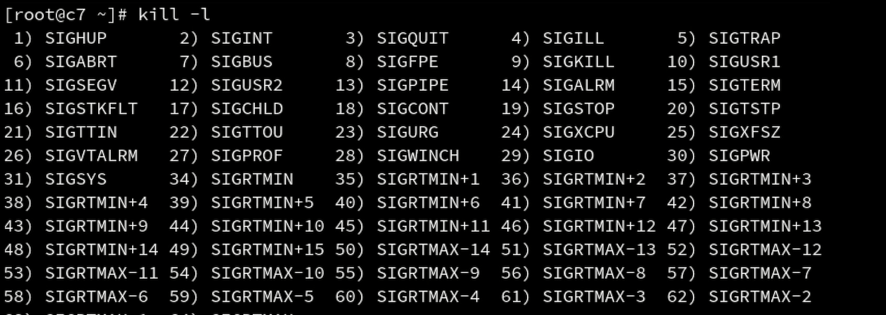

# 系统管理篇

## 网络状态查看、设置工具


1）net-tools

* ifconfig
* route
* netstat

    2）iproute2

* ip
* ss

### net-tools系列

#### ifconfig（可以单独查一个网卡）

[ifconfig参考](https://blog.csdn.net/qian_xia_er/article/details/79950955)

从centos7开始，系统默认的网卡命名有已经不是我们熟悉的ethX方式了，网卡命名会根据网卡的硬件信息，插槽位置等有关； 例如： 

eno1： 板载网卡 

ens33：PCI-E网卡 

enp0s3：无法获取物理信息的PCI-E网卡 

centOS 7使用了一致性网络设备命名，以上都不匹配则使用eth0


#### 更改网卡名称显示规则

比如依然想要网卡名称显示为ethX的形式：

1. 编辑/etc/default/grub文件,增加biosdevname=0和net.ifnames=0
2. 更新grub：grub2-mkconfig -o /boot/grub2/grub.cfg 
3. reboot重启


规则：


#### 用mii-tool和ethtool 查看网线是否正确连接到网卡


#### route -n查看网关

网关为0.0.0.0指不需要网关，与ip对应机器直连


#### net-tools修改网络配置

            1）启关网卡

* * ifconfig eth0 up
  * ifup eth0
  * ifconfig eth0 down 
  * ifdown eth0

                2） 配置ip地址

* * ifconfig eth0 192.168.1.56 netmask 255.255.255.0 broadcast 192.168.1.255
  * ifconfig eth0 192.168.1.56

                3）修改默认网关路由配置                   

                      route add default gw 192.168.1.1 eth0                   

                       route del default gw 192.168.1.1 eth0                

                4）修改指定网段                    

                       route add -net 192.168.0.0 netmask 255.255.255.0 gw 10.211.55.1                

                 5）修改指定ip路由                    

                        route add -host 10.0.0.1 gw 10.211.55.1

####  iproute2与net-tools对比

                 
    

#### 网络故障排除命令（网络连通性-&gt;端口连通性-&gt;抓包）

* ping ：查看网络连通性以及丢包概率
* traceroute：  跟踪 Internet 协议（IP）数据包传送到目标地址时经过的路径，以及每个阶段的耗费时间、连通性

             [https://blog.csdn.net/llq\_200/article/details/81034345](https://blog.csdn.net/llq_200/article/details/81034345)

* mtr：更为全面的丢包诊断工具 [https://cloud.tencent.com/developer/article/1332118](https://cloud.tencent.com/developer/article/1332118)
* nslookup
*     
* telnet：退出方式 ctrl + \] ；进入telnet后，输入quit
* tcpdump：抓包工具。tcpdump -i any -n host 10.0.0.1 and port 80 -w /tmp/dump\(抓取任意网卡上，与10.0.0.1主机联通且端口为80的包，并打印到对应文件中\)

             [https://www.cnblogs.com/ggjucheng/archive/2012/01/14/2322659.html](https://www.cnblogs.com/ggjucheng/archive/2012/01/14/2322659.html)

* netstat -lnpt ：查看端口监听情况 \(l:listen n:不打印域名 p：process t：tcp）

####     linux服务管理

* systemV ：  [https://blog.csdn.net/qq\_27754983/article/details/74520077](https://blog.csdn.net/qq_27754983/article/details/74520077)
* systemD：  [http://www.ruanyifeng.com/blog/2016/03/systemd-tutorial-part-two.html](http://www.ruanyifeng.com/blog/2016/03/systemd-tutorial-part-two.html)

                9、网络配置文件（只有修改了配置文件，重启网卡或者机器，修改项才能永久生效）        1）网络管理程序 sysV和systemd

* * service network start \| stop \| restart
  * chkconfig -list network
  * chkconfig --level 2345 network off \| on 打开/禁用
  * systemctl list-units-files NetworkManage.service
  * systemctl start \| stop \| restart NetworkManage.service
  * systemctl enable \| disable NetworkManager --一般禁用掉systemd的管理方式，避免冲突

        2）网络配置文件更改

* * 修改配置文件（/etc/sysconfig/network-scripts）： [https://blog.csdn.net/chinaltx/article/details/86497165\#2.1%20%E9%85%8D%E7%BD%AE%E6%96%87%E4%BB%B6%E6%89%80%E5%9C%A8%E7%9A%84%E6%96%87%E4%BB%B6%E5%A4%B9](https://blog.csdn.net/chinaltx/article/details/86497165#2.1%20%E9%85%8D%E7%BD%AE%E6%96%87%E4%BB%B6%E6%89%80%E5%9C%A8%E7%9A%84%E6%96%87%E4%BB%B6%E5%A4%B9)

                       

* * service network restart（重启网络服务生效）

#### 修改主机名

* hostname 可以查看当前主机名
* hostname [liuhao.com](http://liuhao.com/) 临时修改主机名
* hostnamectl  set-hostname [liuhao.com](http://liuhao.com/) 永久修改主机名 --注意需要去/etc/hosts加入127.0.0.1映射到主机名的配置，否则机器启动有问题


## 软件包管理

### 包管理器

### 

### rpm包格式 

  

### rpm命令    

 [https://blog.51cto.com/ch666/1752103](https://blog.51cto.com/ch666/1752103)    使用rpm命令管理包，需要手动处理依赖关系，常见参数 rpm -ivh; rpm -e; rpm -qa四、直接编译源码安装

*  yum install gcc gcc-c++  安装编译器
* wget [https://openresty.org/download/openresty-1.15.8.1.tar.gz](https://openresty.org/download/openresty-1.15.8.1.tar.gz)
* tar -zxf openresty-1.15.8.1.tar.gz
* cd openresty-1.15.8.1/
* ./configure --prefix=/usr/local/openresty
* make
* make install

### yum命令rpm的劣势：

1、软件包依赖关系

2、软件包来源不可靠

### yum命令

#### 更换yum源

mv /etc/yum.repos.d/CentOS-Base.repo /etc/yum.repos.d/CentOS-Base.repo.backup  
wget -O /etc/yum.repos.d/CentOS-Base.repo [https://mirrors.aliyun.com/repo/Centos-7.repo](https://mirrors.aliyun.com/repo/Centos-7.repo)yum makecache

#### yum常用命令

* . 列出所有可更新的软件清单命令：yum check-update
* 2. 更新所有软件命令：yum update
* 3. 仅安装指定的软件命令：yum install &lt;package\_name&gt;  如果不指定版本，默认安装最新版本
* 4. 仅更新指定的软件命令：yum update &lt;package\_name&gt;
* 5. 列出所有可安裝的软件清单命令：yum list（yum list installed 列出已安装；yum list updates 列出已更新）
* 6. 删除软件包命令：yum remove &lt;package\_name&gt;
* 7. 查找软件包命令：yum search &lt;keyword&gt;

###  升级内核

#### yum方式：           

 uname -r  
  yum install kernel-3.10.0  
  yum update kernel-3.10.0

#### 源代码编译方式：太复杂，需要看视频跟着

###  grub配置文件介绍：暂时不想学

## 进程管理

### 进程的概念


### 查看进程状态

#### ps命令

ps不带参数，只显示当前终端运行的进程

ps -eLf 可以查看所有进程，以及对应的线程数


#### pstree：查看进程树结构

#### top命令：

按数字1，可以统计每个逻辑cpu占用情况，再按1则返回默认


内容解读：[https://www.cnblogs.com/peida/archive/2012/12/24/2831353.html](https://www.cnblogs.com/peida/archive/2012/12/24/2831353.html)

load average解读：[https://www.ruanyifeng.com/blog/2011/07/linux\_load\_average\_explained.html](https://www.ruanyifeng.com/blog/2011/07/linux_load_average_explained.html)

top -p查看特定进程实时状态

#### nice、renice控制进程优先级

nice可以控制NI，NI会影响PR（决定优先级），但是PR除了人为控制部分，还有内核自动调节的部分

  **Nice值**的**范围**是-20~+19，拥有**Nice值**越大的进程的实际优先级越小，默认的**Nice值**是0

启动时设置优先级：nice -n 10 ./a.sh

已启动的进程改变优先级： renice -n 15 pid

#### jobs、bg、fg任务前后台切换

1、启动任务时，让一个任务在后台运行 nohup 命令 &

2、已经启动的任务，运行在前台，不想要直接关掉，可以暂时调整为stop状态，放在后台挂起。ctrl +   z

3、jobs可以查看当前shell所有后台任务编号。如果一个后台任务（无论running还是stop），想要在后台run起来，则bg jobid；该后台任务如果想调到前台来执行，则fg jobid

#### kill 使用信号方式进行进程通信

kill -l查看所有信号



ctrl-c 发送 SIGINT 信号（kill -2）给前台进程组中的所有进程。常用于终止正在运行的程序

kill -9 强行杀死

#### daemon进程（服务）和nohup的区别

nohup命令使进程忽略hangup信号，nohup的工作目录在我们手动启动进程的目录下，日志也是存放在当前目录的nohup.out文件中

关闭 启动nohup进程的shell窗口，则父进程消失，进程由systemd进程接管


daemon进程在系统启动过程中启动，工作目录会切换到根目录/，关联的输入输出文件不确定

启动daemon进程的父进程消失，进程会由systemd进程接管


#### 系统日志 /var/log

**参考：**[**https://www.cnblogs.com/felixzh/p/8682379.html**](https://www.cnblogs.com/felixzh/p/8682379.html)\*\*\*\*

重要系统日志：

messages: 系统报错

dmesg：内核日志

secure：安全日志

corn: 任务日志

### 系统服务

参考：[https://cshihong.github.io/2018/10/15/Linux下systemctl命令和service、chkconfig命令的区别/](https://cshihong.github.io/2018/10/15/Linux下systemctl命令和service、chkconfig命令的区别/)

service和chkconfig：

service脚本放置在/etc/init.d目录下，使用chkconfig管理服务运行级别

systemd整合了service和chkconfig，且使用更简便。配置文件放置在/usr/lib/systemd/system目录下

#### 服务相关比较


#### 服务启动级别相关


chkconfig将runlever分为六大类


具体含义如下：

```text
# 0 - 停机
# 1 - 单用户模式 
# 2 - 多用户，没有NFS 
# 3 - 完全多用户模式(标准的运行级) 
# 4 - 没有用到 
# 5 - X11(xwindow) 
# 6 - 重新启动 
```

systemd使用target目标进行管理，/usr/lib/systemd/system目录下的\*.target文件代表不同“级别”，其中runlevel.target与chkconfig的6个级别相对应，它会又链接到systemd定义的某个target中（应该说systemd的执行级别更丰富）


systemd其他控制命令以及其他新增命令


SELinux

参考：[https://zhuanlan.zhihu.com/p/30483108](https://zhuanlan.zhihu.com/p/30483108)

linux的访问控制有两种：

DAC（自主访问控制）：以用户为主体，手动配置用户拥有哪些文件资源的权限

MAC（强制访问控制）：SELinux工具实现。以进程为主体，进程带有一个标签，文件带有一个标签，两者标签必须一致进程才能访问文件，就算root用户执行的进程，也会受到控制。由于控制过于严厉，配置过于复杂，生产环境一般关闭

## 存储管理

### 内存查看

#### free

物理内存使用完，会使用swap，但性能变差。如果内存满了，会随机杀掉占用内存较大的进程。因此内存爆满导致进程挂掉时可能的

free查看的时候数字存在四舍五入的情况


### 认识块设备


/dev/sda : 所属组8, 0     

/dev/sda1 : 所属组8, 1

/dev/sda2 : 所属组8, 2

主设备号\(所属组第一个数字\)：代表着某一类型的设备，比如SCSI硬盘、虚拟硬盘、USB等等 

次设备号（所属组第二个数字）：操作系统分配的整数，与主设备号一起（major,minor），组成了该设备在操作系统当中唯一的ID

上述表示sda磁盘分为三个分区

### 查看磁盘

#### fdisk -h 查看磁盘与分区情况


#### parted -l 查看磁盘与分区情况


#### du 查看分区使用率以及挂载目录（一般查看文件夹大小，一步步排查）

直接du，递归显示当前目录下所有文件夹及子文件夹的大小

可以带多个文件夹

常用参数：

-a : 显示目录以及文件夹

-h : 友好显示

-s: 只显示指定目录，不显示子目录或文件

--max-depth=N : 指定遍历深度

常见用法：

du -ah --max-depth=5

du -sm ./\* \| sort -rn \| head -5

#### ll 查看具体文件大小

如果文件中有空洞内容，实际空洞内容不占用磁盘空间，du命令不会计算空洞内容，但是ll会计算

### 文件系统

常见文件系统：

ext4（centos6） xfs（centos7） ntfs（windows）

ext4系统说明

参考：

[https://www.jianshu.com/p/eb8b2a679537](https://www.jianshu.com/p/eb8b2a679537)

[https://monkeysayhi.github.io/2018/03/10/Linux文件系统：inode&block，文件&目录，硬链&软链/](https://monkeysayhi.github.io/2018/03/10/Linux文件系统：inode&block，文件&目录，硬链&软链/)

个人总结：

1、ext4结构

每个分区分为多个block group，每个group包含以下部分

* superblock：记录分区综合信息，group使用情况inode数量以及block数量。每个group的super block是一样的，互为备份
* Group descriptor：记录该group的inode、block总数以及inode bitmap（位图）、block bitmap信息
* inode bitmap：记录每一个inode是否被使用
* block bitmap：记录每一个block是否被占用
* inode table（index node）：inode表。存储每一个inode，inode包含除了文件名外所有文件描述符的内容以及到对应数据块的索引链接
* data block：存储数据以及子文件的inode number和文件名

2、查看磁盘利用率，直接查看superblock内容

3、创建文件时，先查看superblock，找到利用率较小group，根据group中的bitmap分配inode和block，创建inode，存储到inode table，存储data到data block，并建立inode到block链接

4、cat某个文件。从根目录出发（系统存储了根目录的inode number），找到inode number，inode table找到对应data block，data中取出下一级子目录的inode number，不断向下循环操作，直至找到对应文件data。

5、inode不保存文件名，文件名只是文件的别名，多个文件可以使用同一个inode。比如创建的硬链接，硬链接文件名对应的inode就是源文件的inode，硬链接不能跨越分区，因为要指向同一个inode。但是软链接（符号链接，ln -s）会新建一个文件，并分配新的inode，文件data为源文件的路径，系统可以识别出软链接，根据路径去寻找源文件的data。对链接文件所有的权限操作都传递给源文件

6、vim修改文件时，系统会创建一个新的副本文件（源文件保持不变，其他用户访问源内容），当vim完成，系统实际是新建了一个同名文件，文件的inode会变化

7、rm命令删除文件时，只是断开inode到data block的链接，没有直接删除原数据（不管删除多大的文件，执行速度是一样的；如果误删除，是有办法可以恢复的）

8、cp命令复制一个文件，新文件有自己的inode。mv在同一个文件系统操作时inode不变，跨文件系统inode会变化

### facl 文件访问控制列表

参考：[https://blog.51cto.com/mengzhaofu/1834280](https://blog.51cto.com/mengzhaofu/1834280)

对于复杂权限设置，需要用到facl。比如对于同一个文件，user1有r权限，user2有w权限，user3有x权限，使用chmod、chown完成不了这个配置，但是facl可以给user、group细粒度配置权限。

#### 判断某个文件是否配置了facl


#### getfacl 查看文件的facl（权限优先级应该按展示的顺序来，个人不确定）


常见使用方式

```text
setfacl  -m  u:uname:rwx  /path/to/file       #设置单一指定用户条目
setfacl  -x   u:uname  /path/to/file      #删除单一指定用户条目
setfacl  -m  g:gname:rwx  /path/to/file       #设置单一指定用户组条目
setfacl  -x   g:gname:     /path/to/file   #删除单一指定用户组条目
setfacl  -m  u:uname:rwx,g:gname:rx   /path/to/file   #同时设置多条目
setfacl  -x   g:gname:,u:uname   /path/to/file     #同时删除指定多条目
setfacl  -k   /path/to/file               #清除所有默认(default)facl条目
setfacl  -b   /path/to/file               #删除所有facl存在设置
setfacl  -Rm  g:gname:rwX  /path/to/dir_file #对目录有效递归设置，普通文件不会有x权限
seffacl  -M  file.acl  /path/to/file     #将指定格式文本文件条目设置到对应文件
file.acl文件格式： u:uname:rw  等
setfacl  -X   file.acl  /path/to/file    将删除格式文件中匹配的条目
getfacl  /path/to/file1 | setfacl  --set-file=-  /path/to/file2 
#将file1权限复制给file2
setfacl  -m  mask::rw   /path/to/file   #设置mask权限

setfacl  --set  u:uame:rwx  /path/to/file   #重置所有并添加一个条目
```

### 磁盘分区挂载流程

#### 添加磁盘

virtualBox添加虚拟磁盘


#### fdisk 磁盘路径 ，开始分区操作

\#如果磁盘大于2T，要使用parted命令去分区

分区过程中重要操作参数


建立分区流程


#### mkfs 格式化

可以制作的文件系统


#### mount 挂载

mkdir -p /mnt/sdb1

mount /dev/sdb1 /mnt/sdb1

使用mount或者df命令都可以磁盘挂载是否成功


要想永久挂载，需要修改分区文件/etc/fstab，手动添加挂载记录

参考：[https://wiki.archlinux.org/index.php/Fstab\_\(简体中文\)](https://wiki.archlinux.org/index.php/Fstab_%28简体中文%29)


### 磁盘限额


